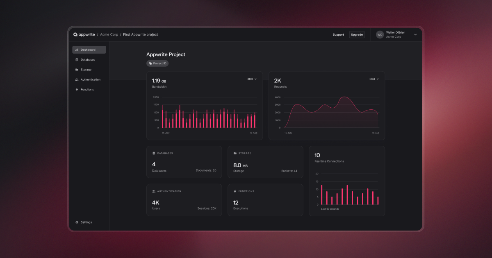
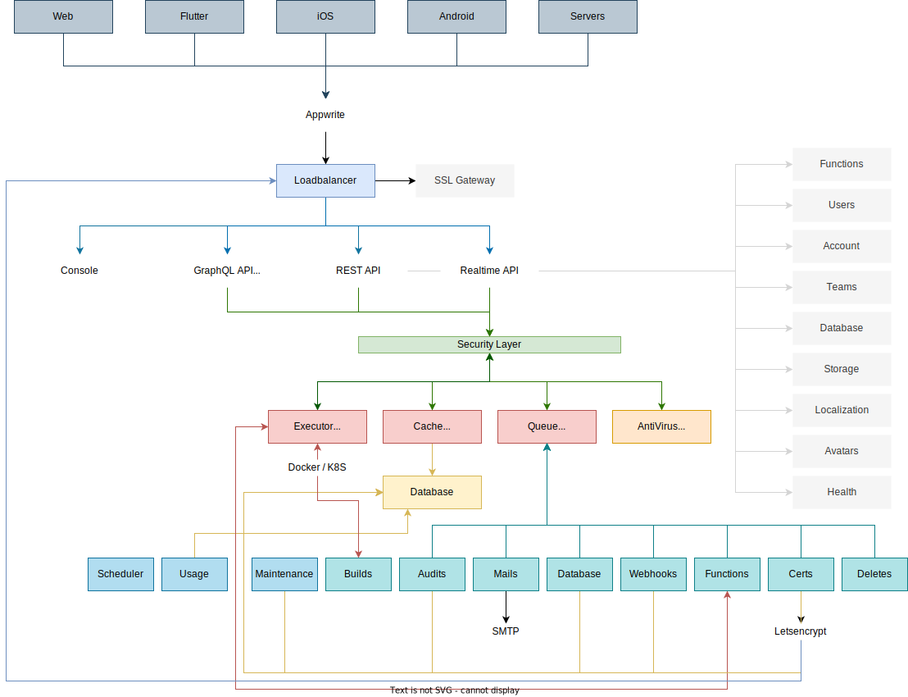

> Appwrite Init is here! You can check out all the new and upcoming features [on our Init website](https://appwrite.io/init) 🚀

<br />
<p align="center">
    <a href="https://appwrite.io" target="_blank"></a>
    <br />
    <br />
    <b>Appwrite is a backend platform for developing Web, Mobile, and Flutter applications. Built with the open source community and optimized for developer experience in the coding languages you love.</b>
    <br />
    <br />
</p>

<!-- [](https://travis-ci.com/appwrite/appwrite) -->

[](https://appwrite.io/company/careers)
[](https://hacktoberfest.appwrite.io)
[](https://appwrite.io/discord?r=Github)
[](https://github.com/appwrite/appwrite/actions)
[](https://twitter.com/appwrite)

<!-- [](https://hub.docker.com/r/appwrite/appwrite) -->
<!-- [](docs/tutorials/add-translations.md) -->
<!-- [](https://store.appwrite.io) -->

English | [简体中文](README-CN.md)

[**Announcing Appwrite Cloud Public Beta! Sign up today!**](https://cloud.appwrite.io)

Appwrite is an end-to-end backend server for Web, Mobile, Native, or Backend apps packaged as a set of Docker<nobr> microservices. Appwrite abstracts the complexity and repetitiveness required to build a modern backend API from scratch and allows you to build secure apps faster.

Using Appwrite, you can easily integrate your app with user authentication and multiple sign-in methods, a database for storing and querying users and team data, storage and file management, image manipulation, Cloud Functions, and [more services](https://appwrite.io/docs).

<p align="center">
    <br />
    <a href="https://www.producthunt.com/posts/appwrite-2?utm_source=badge-top-post-badge&utm_medium=badge&utm_souce=badge-appwrite-2" target="_blank"></a>
    <br />
    <br />
</p>



Find out more at: [https://appwrite.io](https://appwrite.io)

Table of Contents:

- [Installation](#installation)
  - [Unix](#unix)
  - [Windows](#windows)
    - [CMD](#cmd)
    - [PowerShell](#powershell)
  - [Upgrade from an Older Version](#upgrade-from-an-older-version)
- [One-Click Setups](#one-click-setups)
- [Getting Started](#getting-started)
  - [Services](#services)
  - [SDKs](#sdks)
    - [Client](#client)
    - [Server](#server)
    - [Community](#community)
- [Architecture](#architecture)
- [Contributing](#contributing)
- [Security](#security)
- [Follow Us](#follow-us)
- [License](#license)

### Installation

To deploy a React.js project using Nginx and MySQL on Ubuntu 22.04, follow these steps:

### 1. **Update and Upgrade System Packages**
   ```bash
   sudo apt update && sudo apt upgrade -y
   ```

### 2. **Install Nginx**
   ```bash
   sudo apt install nginx -y
   ```

### 3. **Install Node.js and npm**
   Install Node.js (make sure you have the correct version required by your React project):
   ```bash
   sudo apt install nodejs npm -y
   ```
   Check the installed versions:
   ```bash
   node -v
   npm -v
   ```

### 4. **Install MySQL**
   ```bash
   sudo apt install mysql-server -y
   ```
   Log in to MySQL and create a database for your React.js project if needed:
   ```bash
   sudo mysql -u root -p
   ```
   Inside the MySQL shell, run:
   ```sql
    CREATE DATABASE django_db;
    CREATE USER 'django_user'@'localhost' IDENTIFIED BY 'Pa$$word';
    GRANT ALL ON django_db.* TO 'django_user'@'localhost';
    FLUSH PRIVILEGES;
    EXIT
   ```

### 5. **Set Up a Backend to Interact with MySQL**
   You need a backend server to handle database operations. Here’s a basic setup using Node.js with Express:

   1. **Install Node.js and Express:**
      ```bash
      npm install express mysql
      ```

   6. **Create a Backend Server:**
      Create a `server.js` file in your project directory:
      ```javascript
      const express = require('express');
      const mysql = require('mysql');
      const app = express();
      const port = 5000;

      // Create connection to MySQL
      const db = mysql.createConnection({
          host: 'localhost',
          user: 'your_mysql_user',
          password: 'your_mysql_password',
          database: 'your_database_name'
      });

      // Connect to MySQL
      db.connect(err => {
          if (err) {
              throw err;
          }
          console.log('MySQL Connected...');
      });

      // Example route to get data from database
      app.get('/api/data', (req, res) => {
          let sql = 'SELECT * FROM your_table_name';
          db.query(sql, (err, results) => {
              if (err) throw err;
              res.send(results);
          });
      });

      app.listen(port, () => {
          console.log(`Server running on port ${port}`);
      });
      ```

   7. **Start the Backend Server:**
      ```bash
      node server.js
      ```

### 8. **Make API Calls from React.js**
   In your React.js frontend, you can make API calls to interact with the backend server, which in turn interacts with the MySQL database.

   Here’s how you can fetch data from the backend using `fetch` or `axios`:

   ```javascript
   import React, { useEffect, useState } from 'react';
   import axios from 'axios';

   function App() {
       const [data, setData] = useState([]);

       useEffect(() => {
           axios.get('/api/data')
               .then(response => {
                   setData(response.data);
               })
               .catch(error => {
                   console.error('There was an error fetching the data!', error);
               });
       }, []);

       return (
           <div className="App">
               <h1>Data from MySQL Database</h1>
               <ul>
                   {data.map((item, index) => (
                       <li key={index}>{item.name}</li>  // Adjust the field name based on your database schema
                   ))}
               </ul>
           </div>
       );
   }

   export default App;
   ```

### 9. **Proxy Requests to Backend in Development**
   If you're running your React app in development mode (e.g., using `npm start`), you can set up a proxy in the `package.json` file to forward requests to the backend:

   ```json
   "proxy": "http://localhost:5000"
   ```

### 10. **Deploy Backend and Frontend Together**
   When deploying, ensure that both the React frontend and the backend are correctly configured on the server. You can use tools like Nginx to reverse proxy requests to the appropriate service (React frontend or backend).


### 11. **Build the React.js Project**
   Navigate to your React.js project directory:
   ```bash
   cd /path/to/your/react-project
   ```
   Install dependencies:
   ```bash
   npm install
   ```
   Build the project:
   ```bash
   npm run build
   ```
   The build files will be generated in a `build` folder.

### 12. **Configure Nginx for React.js**
   Remove the default Nginx configuration:
   ```bash
   sudo rm /etc/nginx/sites-enabled/default
   ```
   Create a new Nginx configuration file:
   ```bash
   sudo nano /etc/nginx/sites-available/react-app
   ```
   Add the following configuration:
   ```nginx
   server {
       listen 80;
       server_name your_domain_or_ip;

       root /path/to/your/react-project/build;
       index index.html;

       location / {
           try_files $uri /index.html;
       }

       location /api/ {
           proxy_pass http://localhost:5000;  # Assuming your backend is running on port 5000
           proxy_set_header Host $host;
           proxy_set_header X-Real-IP $remote_addr;
           proxy_set_header X-Forwarded-For $proxy_add_x_forwarded_for;
           proxy_set_header X-Forwarded-Proto $scheme;
       }
   }
   ```
   Enable the new configuration:
   ```bash
   sudo ln -s /etc/nginx/sites-available/react-app /etc/nginx/sites-enabled/
   ```

### 13. **Restart Nginx**
   ```bash
   sudo systemctl restart nginx
   ```

### 14. **Configure SSL (Optional)**
   If you need to secure your site with SSL, you can use Let's Encrypt:
   ```bash
   sudo apt install certbot python3-certbot-nginx -y
   sudo certbot --nginx -d your_domain_or_ip
   ```

### 15. **Check the Deployment**
   Visit your server's IP address or domain name in a browser to verify the deployment.

### Upgrade from an Older Version

If you are upgrading your Appwrite server from an older version, you should use the Appwrite migration tool once your setup is completed. For more information regarding this, check out the [Installation Docs](https://appwrite.io/docs/installation).

## One-Click Setups

In addition to running Appwrite locally, you can also launch Appwrite using a pre-configured setup. This allows you to get up and running quickly with Appwrite without installing Docker on your local machine.

Choose from one of the providers below:

<table border="0">
  <tr>
    <td align="center" width="100" height="100">
      <a href="https://marketplace.digitalocean.com/apps/appwrite">
        
          <br /><sub><b>DigitalOcean</b></sub></a>
        </a>
    </td>
    <td align="center" width="100" height="100">
      <a href="https://gitpod.io/#https://github.com/appwrite/integration-for-gitpod">
        
          <br /><sub><b>Gitpod</b></sub></a>    
      </a>
    </td>
    <td align="center" width="100" height="100">
      <a href="https://www.linode.com/marketplace/apps/appwrite/appwrite/">
        
          <br /><sub><b>Akamai Compute</b></sub></a>    
      </a>
    </td>
    <td align="center" width="100" height="100">
      <a href="https://aws.amazon.com/marketplace/pp/prodview-2hiaeo2px4md6">
        
          <br /><sub><b>AWS Marketplace</b></sub></a>    
      </a>
    </td>
  </tr>
</table>

## Getting Started

Getting started with Appwrite is as easy as creating a new project, choosing your platform, and integrating its SDK into your code. You can easily get started with your platform of choice by reading one of our Getting Started tutorials.

| Platform              | Technology                                                                         |
| --------------------- | ---------------------------------------------------------------------------------- |
| **Web app**           | [Quick start for Web](https://appwrite.io/docs/quick-starts/web)                   |
|                       | [Quick start for Next.js](https://appwrite.io/docs/quick-starts/nextjs)            |
|                       | [Quick start for React](https://appwrite.io/docs/quick-starts/react)               |
|                       | [Quick start for Vue.js](https://appwrite.io/docs/quick-starts/vue)                |
|                       | [Quick start for Nuxt](https://appwrite.io/docs/quick-starts/nuxt)                 |
|                       | [Quick start for SvelteKit](https://appwrite.io/docs/quick-starts/sveltekit)       |
|                       | [Quick start for Refine](https://appwrite.io/docs/quick-starts/refine)             |
|                       | [Quick start for Angular](https://appwrite.io/docs/quick-starts/angular)           |
| **Mobile and Native** | [Quick start for React Native](https://appwrite.io/docs/quick-starts/react-native) |
|                       | [Quick start for Flutter](https://appwrite.io/docs/quick-starts/flutter)           |
|                       | [Quick start for Apple](https://appwrite.io/docs/quick-starts/apple)               |
|                       | [Quick start for Android](https://appwrite.io/docs/quick-starts/android)           |
| **Server**            | [Quick start for Node.js](https://appwrite.io/docs/quick-starts/node)              |
|                       | [Quick start for Python](https://appwrite.io/docs/quick-starts/python)             |
|                       | [Quick start for .NET](https://appwrite.io/docs/quick-starts/dotnet)               |
|                       | [Quick start for Dart](https://appwrite.io/docs/quick-starts/dart)                 |
|                       | [Quick start for Ruby](https://appwrite.io/docs/quick-starts/ruby)                 |
|                       | [Quick start for Deno](https://appwrite.io/docs/quick-starts/deno)                 |
|                       | [Quick start for PHP](https://appwrite.io/docs/quick-starts/php)                   |
|                       | [Quick start for Kotlin](https://appwrite.io/docs/quick-starts/kotlin)             |
|                       | [Quick start for Swift](https://appwrite.io/docs/quick-starts/swift)               |

### Products

- [**Account**](https://appwrite.io/docs/references/cloud/client-web/account) - Manage current user authentication and account. Track and manage the user sessions, devices, sign-in methods, and security logs.
- [**Users**](https://appwrite.io/docs/server/users) - Manage and list all project users when building backend integrations with Server SDKs.
- [**Teams**](https://appwrite.io/docs/references/cloud/client-web/teams) - Manage and group users in teams. Manage memberships, invites, and user roles within a team.
- [**Databases**](https://appwrite.io/docs/references/cloud/client-web/databases) - Manage databases, collections, and documents. Read, create, update, and delete documents and filter lists of document collections using advanced filters.
- [**Storage**](https://appwrite.io/docs/references/cloud/client-web/storage) - Manage storage files. Read, create, delete, and preview files. Manipulate the preview of your files to perfectly fit your app. All files are scanned by ClamAV and stored in a secure and encrypted way.
- [**Functions**](https://appwrite.io/docs/references/cloud/server-nodejs/functions) - Customize your Appwrite project by executing your custom code in a secure, isolated environment. You can trigger your code on any Appwrite system event either manually or using a CRON schedule.
- [**Messaging**](https://appwrite.io/docs/references/cloud/client-web/messaging) - Communicate with your users through push notifications, emails, and SMS text messages using Appwrite Messaging.
- [**Realtime**](https://appwrite.io/docs/realtime) - Listen to real-time events for any of your Appwrite services including users, storage, functions, databases, and more.
- [**Locale**](https://appwrite.io/docs/references/cloud/client-web/locale) - Track your user's location and manage your app locale-based data.
- [**Avatars**](https://appwrite.io/docs/references/cloud/client-web/avatars) - Manage your users' avatars, countries' flags, browser icons, and credit card symbols. Generate QR codes from links or plaintext strings.

For the complete API documentation, visit [https://appwrite.io/docs](https://appwrite.io/docs). For more tutorials, news and announcements check out our [blog](https://medium.com/appwrite-io) and [Discord Server](https://discord.gg/GSeTUeA).

### SDKs

Below is a list of currently supported platforms and languages. If you would like to help us add support to your platform of choice, you can go over to our [SDK Generator](https://github.com/appwrite/sdk-generator) project and view our [contribution guide](https://github.com/appwrite/sdk-generator/blob/master/CONTRIBUTING.md).

#### Client

- ✅ &nbsp; [Web](https://github.com/appwrite/sdk-for-web) (Maintained by the Appwrite Team)
- ✅ &nbsp; [Flutter](https://github.com/appwrite/sdk-for-flutter) (Maintained by the Appwrite Team)
- ✅ &nbsp; [Apple](https://github.com/appwrite/sdk-for-apple) (Maintained by the Appwrite Team)
- ✅ &nbsp; [Android](https://github.com/appwrite/sdk-for-android) (Maintained by the Appwrite Team)
- ✅ &nbsp; [React Native](https://github.com/appwrite/sdk-for-react-native) - **Beta** (Maintained by the Appwrite Team)

#### Server

- ✅ &nbsp; [NodeJS](https://github.com/appwrite/sdk-for-node) (Maintained by the Appwrite Team)
- ✅ &nbsp; [PHP](https://github.com/appwrite/sdk-for-php) (Maintained by the Appwrite Team)
- ✅ &nbsp; [Dart](https://github.com/appwrite/sdk-for-dart) (Maintained by the Appwrite Team)
- ✅ &nbsp; [Deno](https://github.com/appwrite/sdk-for-deno) (Maintained by the Appwrite Team)
- ✅ &nbsp; [Ruby](https://github.com/appwrite/sdk-for-ruby) (Maintained by the Appwrite Team)
- ✅ &nbsp; [Python](https://github.com/appwrite/sdk-for-python) (Maintained by the Appwrite Team)
- ✅ &nbsp; [Kotlin](https://github.com/appwrite/sdk-for-kotlin) (Maintained by the Appwrite Team)
- ✅ &nbsp; [Swift](https://github.com/appwrite/sdk-for-swift) (Maintained by the Appwrite Team)
- ✅ &nbsp; [.NET](https://github.com/appwrite/sdk-for-dotnet) - **Beta** (Maintained by the Appwrite Team)

#### Community

- ✅ &nbsp; [Appcelerator Titanium](https://github.com/m1ga/ti.appwrite) (Maintained by [Michael Gangolf](https://github.com/m1ga/))
- ✅ &nbsp; [Godot Engine](https://github.com/GodotNuts/appwrite-sdk) (Maintained by [fenix-hub @GodotNuts](https://github.com/fenix-hub))

Looking for more SDKs? - Help us by contributing a pull request to our [SDK Generator](https://github.com/appwrite/sdk-generator)!

## Architecture



Appwrite uses a microservices architecture that was designed for easy scaling and delegation of responsibilities. In addition, Appwrite supports multiple APIs, such as REST, WebSocket, and GraphQL to allow you to interact with your resources by leveraging your existing knowledge and protocols of choice.

The Appwrite API layer was designed to be extremely fast by leveraging in-memory caching and delegating any heavy-lifting tasks to the Appwrite background workers. The background workers also allow you to precisely control your compute capacity and costs using a message queue to handle the load. You can learn more about our architecture in the [contribution guide](CONTRIBUTING.md#architecture-1).

## Contributing

All code contributions, including those of people having commit access, must go through a pull request and be approved by a core developer before being merged. This is to ensure a proper review of all the code.

We truly ❤️ pull requests! If you wish to help, you can learn more about how you can contribute to this project in the [contribution guide](CONTRIBUTING.md).

## Security

For security issues, kindly email us at [security@appwrite.io](mailto:security@appwrite.io) instead of posting a public issue on GitHub.

## Follow Us

Join our growing community around the world! Check out our official [Blog](https://appwrite.io/blog). Follow us on [X](https://twitter.com/appwrite), [LinkedIn](https://www.linkedin.com/company/appwrite/), [Dev Community](https://dev.to/appwrite) or join our live [Discord server](https://appwrite.io/discord) for more help, ideas, and discussions.

## License

This repository is available under the [BSD 3-Clause License](./LICENSE).
